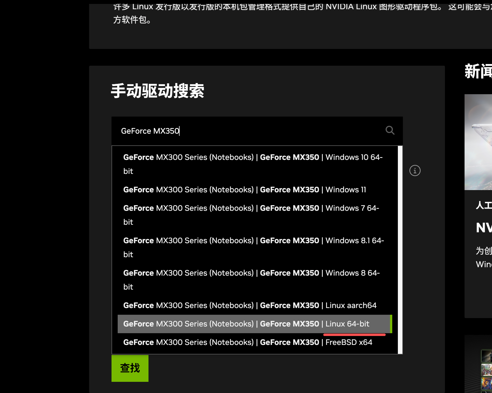
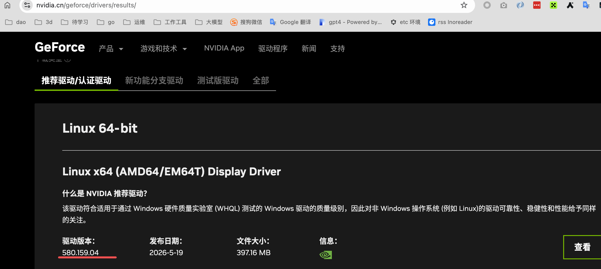

大概分这几层
1. linux 驱动(cuda 安装): 让直接以linux 进程运行的程序能够访问gpu(比如在linux 服务器上直接安装pytouch等后运行程序 python xxx)
2. 容器驱动(NVIDIA Container Toolkit): 让容器内的程序可以访问gpu(如docker run 或nerdctl run等,镜像内的容器能够访问到gpu--其实就是自动挂载gpu相关驱动文件到容器内)
3. k8s 驱动(gpu operator): 让k8s 的pod 内的程序能够访问gpu(让pod能够通过配置声明自己需要gpu,然后把gpu驱动挂载到pod内),

## linux 驱动（cuda 安装）
参考: https://docs.nvidia.com/cuda/cuda-installation-guide-linux/#runfile-installation

### 查找自己的gpu 对应的驱动版本和安装

如下图，我的型号是: GeForce MX350
```
root@192-168-1-205:~# lspci |grep -i nvi
00:14.3 Network controller: Intel Corporation Ice Lake-LP PCH CNVi WiFi (rev 30)
01:00.0 3D controller: NVIDIA Corporation GP107M [GeForce MX350] (rev a1)
```

到这里填写如型号（如我的填写: GeForce MX350）https://www.nvidia.cn/geforce/drivers/
选择自己系统型号,点击后，会自动填写信息，点击"查找"


回到结果界面,这里就是你的驱动版本


然后下载,复制到服务器,进行安装(但这种方式废弃了,新的按照见下)

```
# 将 Nouveau 加入黑名单
disable-nouveau(){
cat > /etc/modprobe.d/nvidia-installer-disable-nouveau.conf <<-EOF
blacklist nouveau
options nouveau modeset=0
EOF

update-initramfs -u
reboot
}
lsmod | grep nouveau && disable-nouveau


apt install build-essential dkms linux-headers-$(uname -r)

chmod +x NVIDIA-Linux-x86_64-580.159.04.run
./NVIDIA-Linux-x86_64-580.159.04.run

# 验证
nvidia-smi
```

## 容器驱动(NVIDIA Container Toolkit)

参考: https://docs.nvidia.com/datacenter/cloud-native/container-toolkit/latest/install-guide.html


## k8s 驱动(gpu operator)
参考: https://docs.nvidia.com/datacenter/cloud-native/gpu-operator/latest/getting-started.html