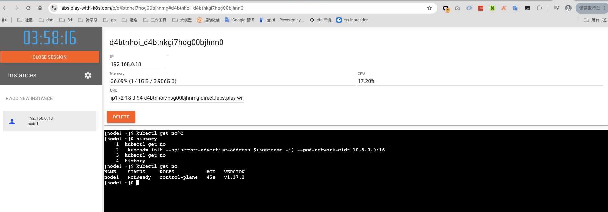

## 介绍

一般我们接触 k8s ，大概路径都是(注: 这里并没有必须的递进关系，只是工作方向不同, 大家投入不同而已 ):

1. 了解 k8s 是干什么的 (了解,比如产品经理等,了解就够了)
2. 会基本的使用 k8s 部署自己的应用 (入门,比如研发,应用运维等)
3. 应用出问题时能够排除和解决, 或者定位到是 k8s 平台故障反馈给 k8s 团队 (会使用,比如应用运维等)
4. 会部署 k8s,能够对集群的各种问题进行排除和定位,快速恢复 (运维入门,比如 k8s 方向的运维等)
5. 能够对 k8s 的故障面进行分析并建设全面的监控告警体系,变更管理规范,故障处理手册, 对上层应用部署建立相应的规范 等,保证集群的稳定运行 (会运维,比如 k8s 方向的运维 等)
6. 能够对 k8s 代码的故障进行分析定位,反馈社区或提交代码修复, 结合自己公司的使用场景对 k8s 开发一些 功能特性或插件 ( k8s 开发者 )

本来想着现在 k8s 基本已经是 事实上 的 新操作系统 (就像linux 一样普及),但发现还是有一些人还没接触过
因此为了我避免每次都要找资料进行分享, 这里汇总下我收集的感觉比较好的学习资料

### 准备
学习k8s 前,建议你会如下内容,如果不会建议先学习下
(这部分自己搜资料吧😄)

1. 了解linux: 知道linux,会常见的命令
2. 了解开发语言,如java,go,python (不需要会写代码)
3. 了解 api 概念, 知道 yaml,json 的语法

### k8s 介绍

1. 动画方式讲解 k8s 的概念

    中文版: [https://mp.weixin.qq.com/s?src=11&timestamp=1763170282&ver=6359&signature=RICB4M13QlaeXpgfPfJBLM-iuWWRVLqy7dGC3z*nn59nMscYzQg2d7YLMQpbIdutdoNKRNjWxHXj*7hcqiGRpG6HQjps*5clDk8t84enfBq-cmoZv7tAXn2y5klXvajL&new=1](https://mp.weixin.qq.com/s?src=11&timestamp=1763170282&ver=6359&signature=RICB4M13QlaeXpgfPfJBLM-iuWWRVLqy7dGC3z*nn59nMscYzQg2d7YLMQpbIdutdoNKRNjWxHXj*7hcqiGRpG6HQjps*5clDk8t84enfBq-cmoZv7tAXn2y5klXvajL&new=1)

    官方动画 https://www.cncf.io/phippy/the-childrens-illustrated-guide-to-kubernetes/

2. 程序员版

    官方: https://kubernetes.io/zh-cn/docs/concepts/overview/

    好的培训资料: https://edu.aliyun.com/course/314614/

### k8s 本地部署

1. 现成的环境
    如果你不想倒腾安装(因为大部分人只需要使用就行了),想快速有个k8s 的练手环境, 可以用这个: https://labs.play-with-k8s.com/

    

    说明见: https://zhuanlan.zhihu.com/p/674130426

2. 自己安装环境

    我个人推荐用kind (因为后续其他开源的k8s 相关的项目, demo 也都是用这个)

    官方指导: https://kubernetes.io/zh-cn/docs/tasks/tools/

### k8s 使用(如何部署应用)

免费的培训资料: https://edu.aliyun.com/course/314614/

1. 先从一个hello work 开始 体会

    官方: https://kubernetes.io/zh-cn/docs/tutorials/kubernetes-basics/

2. 全面了解使用

    可以全面阅读下这个目录下的每个文档: https://kubernetes.io/zh-cn/docs/concepts/
    这里基本包含了所有k8s 的功能的使用说明

### k8s 常见问题排查

