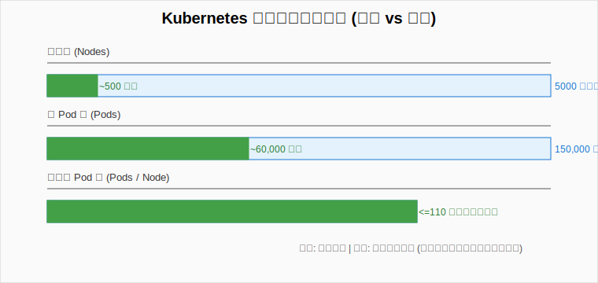
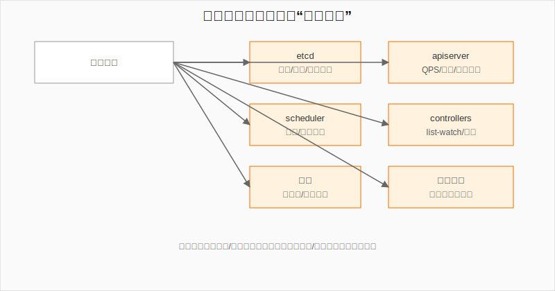
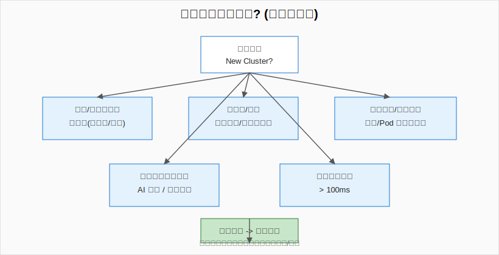
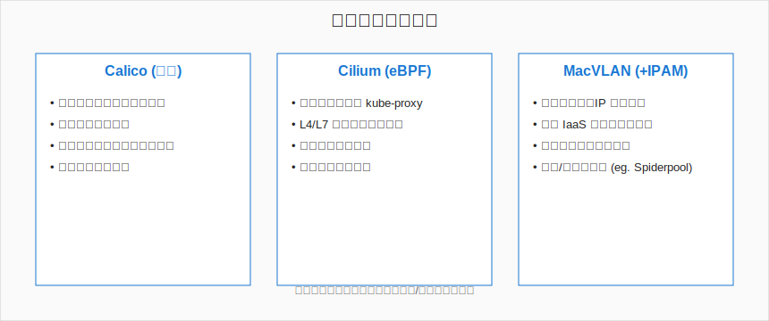
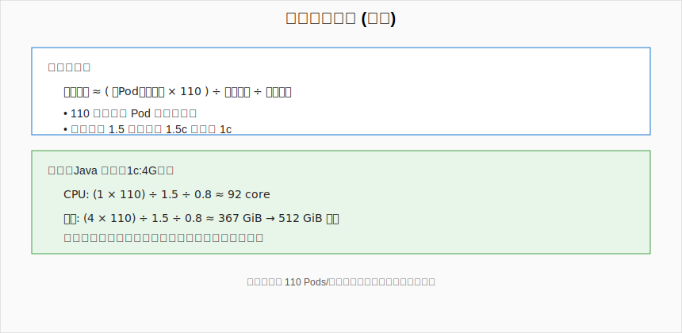

## 介绍

本文汇总在部署 Kubernetes（后文简称 K8s）过程中与稳定性、维护成本相关的注意事项（仅个人观点），供规划集群规模、拆分策略与网络/节点选型时参考。

## 集群规模

官方大规模集群建议： <https://kubernetes.io/docs/setup/best-practices/cluster-large/>
 
1. 单节点建议不超过 110 个 Pod（源于 kubelet 默认上限；进程/连接数激增会影响系统调度性能）。
2. 单集群节点数量不建议超过 500（官方理论上限约 5000；若每节点 Pod 很少，例如 AI 集群每节点少于 10 个 Pod，可适当提高上限）。
3. 单集群 Pod 数量不建议超过 60,000（官方理论上限约 150,000）。
4. 单命名空间下同类资源（Pod 等）数量建议不超过 1,000。原因：API 的 List/Watch 无分页，超大量对象初始 List 会明显放大响应时间（可用缓存/索引缓解，但复杂度上升）。



> 图：绿色为实践建议区间，蓝色为官方可达上限。规模越靠近上限，调度/存储/网络的系统性风险与维护复杂度呈非线性上升。

注意：

Q: 为什么不做一个超大单集群，这样只需要维护一个集群即可？
A: 集群越大，维护难度越大，各组件更容易触发性能瓶颈，随之而来的是大量高难度的维护工作。例如：

  比如：

  1. etcd：当对象数与写入 QPS 持续上升，压缩与事务延迟会明显增大，需要分片或替换。
      字节的方案：自研替代 etcd 的存储组件 <https://github.com/kubewharf/kubebrain/blob/main/docs/design_in_detail_cn.md>
      蚂蚁的方案：分多个 etcd 存储 <https://www.sofastack.tech/blog/ant-massive-sigma-cluster-etcd-splitting-in-practice/>
      阿里：修改了 etcd 代码 <https://zhuanlan.zhihu.com/p/657824957>
  2. apiserver：仅仅是海量节点的 kubelet 心跳与各类 Controller/Operator 的并发请求会产生就有高的 QPS，需要扩容、限流与网关分流等规划。
      字节的方案：自研 KubeGateway 组件 <https://zhuanlan.zhihu.com/p/546398348>
      阿里：<https://zhuanlan.zhihu.com/p/657824957>
  3. scheduler：大规模集群下，Pod 并发创建量高；默认调度串行绑定，一个一个调度会导致排队时间显著增加。
      社区调优参考：<https://kubernetes.io/docs/concepts/scheduling-eviction/scheduler-perf-tuning/>
      其他大厂通常自研调度器：<https://zhuanlan.zhihu.com/p/563944955>
  4. controller 与 operator：瓶颈主要源于 List/Watch 机制。其会将目标资源全量缓存到内存并持续 Watch 变化；当对象规模巨大时，启动全量 List 耗时（分钟级）、内存占用暴涨，事件吞吐可能跟不上（控制器通常逐条处理事件）。
  5. 网络：取决于网络方案。例如使用 Calico 时，节点上的路由/策略规则会非常多。一般推荐下沉到 IaaS 网络能力（如 MacVLAN 等）承载复杂度。
  6. 故障爆炸半径：出现故障后，受影响的 Pod 数量多，影响面广。



> 图：单一“超大集群”会在 etcd、apiserver、scheduler、控制器、网络以及故障影响半径多个维度放大复杂度。

## 集群部署策略（什么时候建新集群）

是否新建集群没有统一标准，以下从稳定性、维护与隔离等维度给出参考：

拆分的好处：集群更小稳定性更高；同类业务归群管理更方便。
合并的好处：集群数量更少，统一运维与资源利用率更高。

1. 网络区隔离：若存在互联网区/内网区等严格隔离的安全域，建议每个网络区独立一个集群。比如银行等,会划分互联网区和内网区等,则推荐每个网络区一个集群
2. 多活/高可用：同城双活、两地三中心等架构，建议按高可用要求为每个机房（或可用区）建设 1–2 个集群，避免集群层面单点故障。
3. 跨区高时延：若机房之间网络时延较高（如 >100ms），建议分别建设集群。
4. 规模逼近阈值：当单集群规模已接近建议上限，可按业务域等维度拆分（如电商核心/内部支撑分别建集群）。
5. 业务特性截然不同：如 AI 训练/推理集群与通用业务集群建议分离，便于资源、网络与调度策略独立演进。



> 图：满足任一关键触发条件（安全域隔离 / 多活 / 规模逼近阈值 / 业务类型截然不同 / 高跨区延迟）即可进入“新建集群”路径。

## 网络选型

1. Calico：常规场景推荐使用 Calico 直通/BGP 模式，架构简单，基于 Linux 路由表实现。网络或 Linux 运维同学稍加学习即可完成日常维护与应急处理。
2. Cilium：基于内核 eBPF 的高性能方案，功能强大，支持 L4/L7 与网关能力，可替代 kube-proxy，观测能力也很强；团队具备相应维护能力时推荐采用。
3. MacVLAN：适用于对 IP 审计/合规要求高、规模较大的场景，使容器网络更贴近虚拟机网络形态，可复用现有 IaaS 网络管理平台/工具/规范（强烈推荐使用道客开源的 [Spiderpool](https://github.com/spidernet-io/spiderpool)，已在大规模金融客户生产落地，稳定且功能丰富）。



> 图：Calico（简单稳定）、Cilium（高性能 + eBPF 能力）、MacVLAN（合规 / 大规模 / 复用 IaaS）。依据团队能力、合规要求、性能与可观测诉求选择。

## 节点配置

由于单节点不建议超过 110 个 Pod（110 个 Pod 往往对应 220+ 容器进程，进程/连接数较大，Linux 上的上下文切换与内核资源压力都会上升），因此单机配置并非越大越好，否则可能造成资源浪费。

可结合业务场景进行节点规格估算。大致逻辑：

```text
节点可用 CPU ≈ (Pod 平均请求 CPU × 110) ÷ 超卖系数 ÷ 系统资源预留比例
节点可用内存 ≈ (Pod 平均请求内存 × 110) ÷ 超卖系数 ÷ 系统资源预留比例

其中：
- 超卖系数：例如超卖 50% 则为 1.5（即请求 1.5 Core，实际物理仅预留 1 Core）。
- 系统资源预留比例：实际运行期为系统与突发预留的比例，例如 0.8 表示最多使用到物理资源的 80%。
```

示例：若多数业务 Pod 为 Java，常见请求比例为 CPU:内存 = 1:4 或 1:2，例如 1 Core / 4 GiB、4 Core / 8 GiB。

按 1 Core / 4 GiB 估算，超卖系数 1.5（超卖 50%），系统资源预留 0.8（预留 20%）：

CPU ≈ 1 × 110 / 1.5 / 0.8 ≈ 92 Core
内存 ≈ 4 × 110 / 1.5 / 0.8 ≈ 367 GiB

可选购约 96 Core / 512 GiB 规格的物理服务器（向上规整并考虑中间件占用与突发）。

以上仅为示例，需结合实际业务画像进行修正（例如中间件集群往往需要更高内存作为缓存）。



> 图：通过“平均单 Pod 资源 × 110 / 超卖系数 / 系统预留”得到近似节点规格；再结合真实画像（语言栈 / 中间件 / 波峰波谷）修正。
