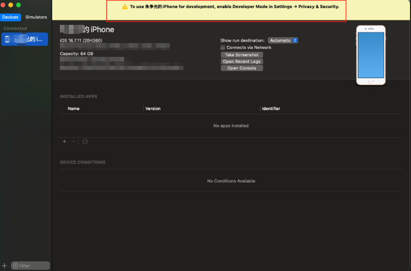

## 介绍

苹果手机安装应用正常来说有以下方式:

1. app store 下载: 需要开发者上架(需要开发者掏钱并且通过苹果的审核)
2. testflight 下载: (需要开发者掏钱并且通过苹果的审核,但比app store 审核宽松)

非正常的:

1. 开发者模式: 只要有apple 账户就可以
2. 越狱: 一般都不考虑

这里将的是开发者模式

## 开发者模式

### 环境准备

1. MacOS 升级到最新版，并下载Xcode
2. 用USB连接电脑和手机。解锁手机。
3. 打开 XCode 应用, 从顶部菜单项选择 "Window" -> "Devices and Simulators"
    
4. 这里一般就有自己手机了，如果没有，可以按下面的截图自己加一下
    
5. 第一次连接，一般会提示这个信息，让你的手机开启开发者模式，根据提示操作即可
    
6. 比如我的手机就是"设置"->"隐私与安装",然后划到最下面有个"",选择打开后会提示重启手机,然后会再让你确认一次,然后就好了

### 下载app

这里就分两种情况:

#### 代码构建方式

1. 如果你是基于代码构建(比如开源下载的代码或自己写的代码),打开项目,然后选择设备,点击运行,就会自动构建和下载到手机了(测试发现,在同一个WIFI网络内,后续的升级不用USB线连接电脑也可以)
    
2. 第一次安装会提示"不受信任的开发者",
    
    然后打开"设置"->"通用"->"VPN与设备管理"选择对应的证书

    点击"信任 xxx",然后再重新打开app或者重新在Xcode里面点击运行即可
    

#### ipa 文件方式

1. 如有你已经构建了带签名的 ipa 包,可以打开 XCode 应用, 从顶部菜单项选择"Window" -> "Devices and Simulators",选择自己手机的

2. 一样会提示签名问题,参考上面的操作即可
另: 如果ipa 没有签名,修改ipa的签名见(未测试): https://www.reddit.com/r/jailbreak/comments/ecojvu/help_how_to_fix_this_when_trying_to_installsign/ 