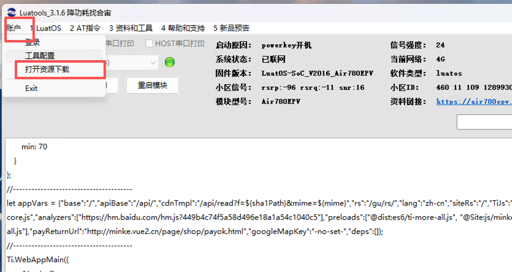

今天补办电信手机卡的时候,发现电信套餐可以办理一共5个电话卡了,想起我好久之前买的4G 模块AIR780EP, 果断花了0元申请新开了一个副卡
因为这个板子官方已经放入归档,很多资料比较乱,今天折腾了大半天才搞定这个板子的下载,这里记录下(也是担心那天官方就把资料全清理了😄)


## 下载

参考: https://docs.openluat.com/air780ep/luatos/app/Public_data/


### 硬件准备
1. 板子插入卡,然后连接上线

    


2. 点击板子上的power按键,检测电脑的"设备管理器",是否多出对应的设备

    注: 如果用线连接电话和板子后,点击boot按键,电脑的"设备管理器"里面没有重新加载出新设备,一般会向下图一样,多出几个设备
    如果没有,可能是线是只充电的线,不是数据线(充电线里面只有两根电源和地线----我这换了好几根才找到一根数据线)
    


### 软件准备
1. usb 驱动程序

    这个板子是不用下载的,这里说明下😄

2. Luatools 工具下载

    见: https://docs.openluat.com/Luatools/
    下载后,根据说明进行安装
    

安装完成后需要下载core 文件(固件)

1. 点击"账户"-> "打开资源下载",会弹出一个窗口,选择"Air780EP"对应的luatos 固件,点击"开始下载即可"

    这一步只是下载文件到你电脑上
    

    

### 下载固件
0. 用线重新连接板子

    如果之前连接着,插拔一下板子(避免板子已经开机),然后记得不要点任何按键---这个时候板子只有红色的电源灯亮

1. 这里什么都不选,点击"下载固件"按钮

    注: 第一次没有从项目下载固件是因为 "下载固件" 界面的提示信息更多一些
    


2. 在打开的如下界面中,选择上一步下载的core文件,点击"下载按钮"

    一般是安装Luatools目录的"resource"目录下
    

3. 点击"下载按钮"后,进度条会变化,然后

    ```
    a. 按住"BOOT"按钮不放
    b. 按住"power"按钮,待进度条变化后,松开"power"按钮
    c. 待下载完成后,在松开"BOOT" 按钮
    ```

    

    注: 我这边下载第一次完成后,后续下载貌似是不需要点击任何按键的(感觉是默认安装的固件和程序导致我这里尝试了很久)


### 下载第一个程序

##### 准备程序
创建个代码目录,比如"luatos/4g-websocket"目录,然后目录下创建一个main.lua,贴如如下内容


```lua
PROJECT = "airtun"
VERSION = "1.0.0"

-- sys库是标配
_G.sys = require("sys")
-- _G.sysplus = require("sysplus")


-- Air780EP的AT固件默认会为开机键防抖, 导致部分用户刷机很麻烦
if rtos.bsp() == "EC618" and pm and pm.PWK_MODE then
    pm.power(pm.PWK_MODE, false)
end

-- 报错信息自动上报到平台,默认是iot.openluat.com
-- 支持自定义, 详细配置请查阅API手册
-- 开启后会上报开机原因, 这需要消耗流量,请留意
if errDump then
    errDump.config(true, 600)
end

local wsc = nil

sys.taskInit(function()

    sys.waitUntil("IP_READY")                -- 等待联网成功

    -- 这是个测试服务, 当发送的是json,且action=echo,就会回显所发送的内容
    -- 加密TCP链接 wss 表示加密
    wsc = websocket.create(nil, "wss://echo.airtun.air32.cn/ws/echo")
    -- 这是另外一个测试服务, 能响应websocket的二进制帧
    -- wsc = websocket.create(nil, "ws://echo.airtun.air32.cn/ws/echo2")
    -- 以上两个测试服务是Java写的, 源码在 https://gitee.com/openLuat/luatos-airtun/tree/master/server/src/main/java/com/luatos/airtun/ws

    if wsc.headers then
        wsc:headers({Auth="Basic ABCDEGG"})
    end
    wsc:autoreconn(true, 3000) -- 自动重连机制
    wsc:on(function(wsc, event, data, fin, optcode)
        --[[
            event的值有:
            conack 连接服务器成功,已经收到websocket协议头部信息,通信已建立
            recv   收到服务器下发的信息, data, payload 不为nil
            sent   send函数发送的消息,服务器在TCP协议层已确认收到
            disconnect 服务器连接已断开

            其中 sent/disconnect 事件在 2023.04.01 新增
        ]]
        -- data 当事件为recv是有接收到的数据
        -- fin 是否为最后一个数据包, 0代表还有数据, 1代表是最后一个数据包
        -- optcode, 0 - 中间数据包, 1 - 文本数据包, 2 - 二进制数据包
        -- 因为lua并不区分文本和二进制数据, 所以optcode通常可以无视
        -- 若数据不多, 小于1400字节, 那么fid通常也是1, 同样可以忽略
        log.info("wsc", event, data, fin, optcode)
        -- 显示二进制数据
        -- log.info("wsc", event, data and data:toHex() or "", fin, optcode)
        if event == "conack" then -- 连接websocket服务后, 会有这个事件
            log.info("WebSocket connect succeed!")
            sys.publish("wsc_conack")
        end
    end)
    wsc:connect()
    -- 等待conack是可选的
    sys.waitUntil("wsc_conack")
    --local stat = wsc:ready()
    -- 定期发业务ping也是可选的, 但为了保存连接, 也为了继续持有wsc对象, 这里周期性发数据
    while true do
        wsc:send((json.encode({action="echo", msg=os.date()})))
        sys.wait(15000)
        -- 发送二进制帧, 2023.06.21 之后编译的固件支持
        -- wsc:send(string.char(0xA5, 0x5A, 0xAA, 0xF2), 1, 1)
    end
    wsc:close()
    wsc = nil
end)


-- 用户代码已结束---------------------------------------------
-- 结尾总是这一句
sys.run()
-- sys.run()之后后面不要加任何语句!!!!!
```


##### 开始安装第一个程序

1. 点击"项目管理测试",会弹出下面的窗口,然后点击"创建"按钮,在弹窗中输入项目名,如"4g-demo"

    


2. 选择core 文件

    我一般是把上面"下载固件" 步骤的选择的core文件,复制一份到代码目录的core目录下,然后选择
    


3. 然后选中"添加默认lib",然后点击"增加目录(递归)",选择之前的代码目录

    

4. 然后点击"下载脚本",等待执行完成

    

    执行完成(这里一般会比其他板子时间久,中间会重启板子切换到下载模式,下载完成后又重启板子进入正常启动模式)如下图:
    

5. 检测输出,选中"4G模块USB打印"后,就会自动选择"开始打印"

    
    点击"重启模块",可以看到右边的网络信息,以及下面的日志
    