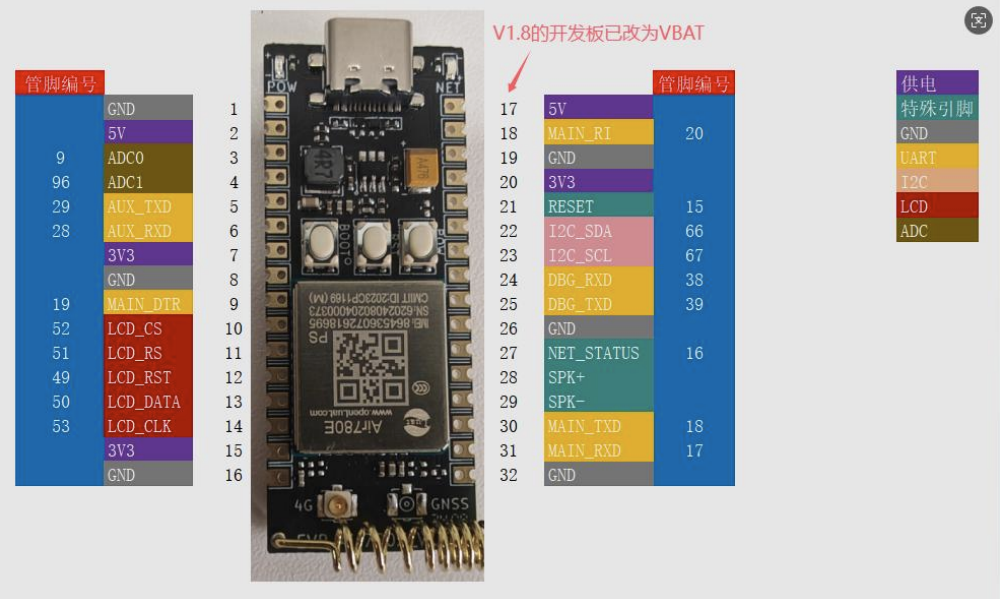
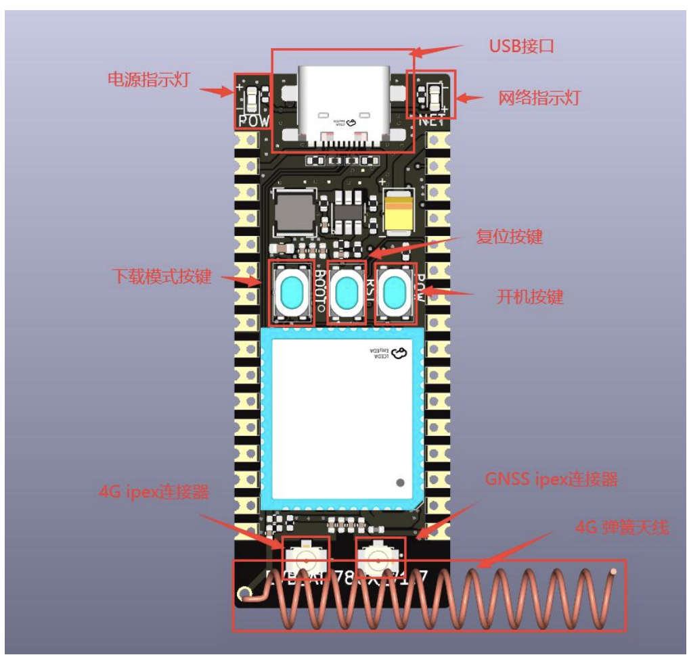

为了避免后续官方删除,这里还是把相关资料截图保存下

如果能访问这里,可以下面文档看官方文档即可: https://docs.openluat.com/air780ep/product/

### 开发版引脚信息

见: https://c.vue2.cn/attachment/20241025095559636_%E5%BC%80%E5%8F%91%E6%9D%BFCore_Air780EP%E4%BD%BF%E7%94%A8%E8%AF%B4%E6%98%8EV1.0.1.pdf

这里存档[20241025095559636_开发板Core_Air780EP使用说明V1.0.1.pdf](../20241025095559636_开发板Core_Air780EP使用说明V1.0.1.pdf)

### 硬件手册
见 https://docs.openluat.com/air780ep/product/file/Air780EP%E7%A1%AC%E4%BB%B6%E6%89%8B%E5%86%8CV1.1.pdf

这里存档[Air780EP硬件手册V1.1.pdf](../Air780EP硬件手册V1.1.pdf)

这里存档[合宙Air780EP模组使用手册-V1.0.7.pdf](../合宙Air780EP模组使用手册-V1.0.7.pdf)