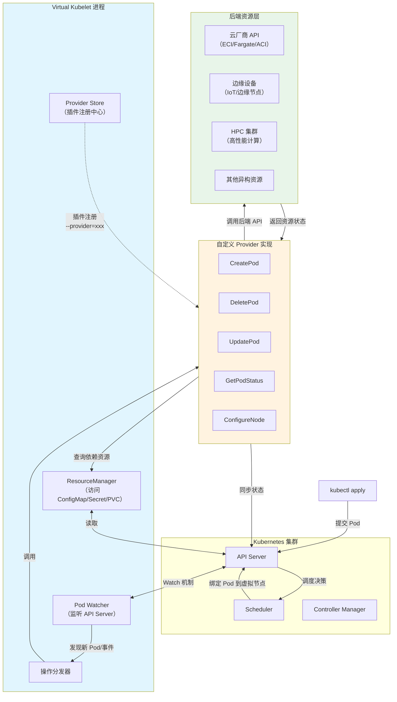
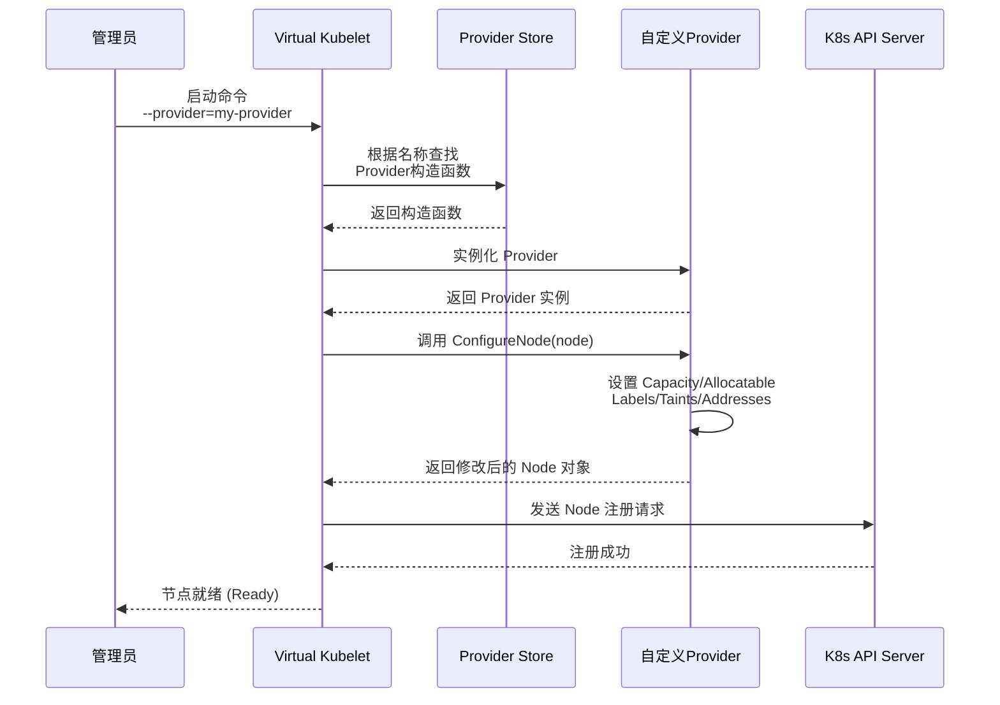
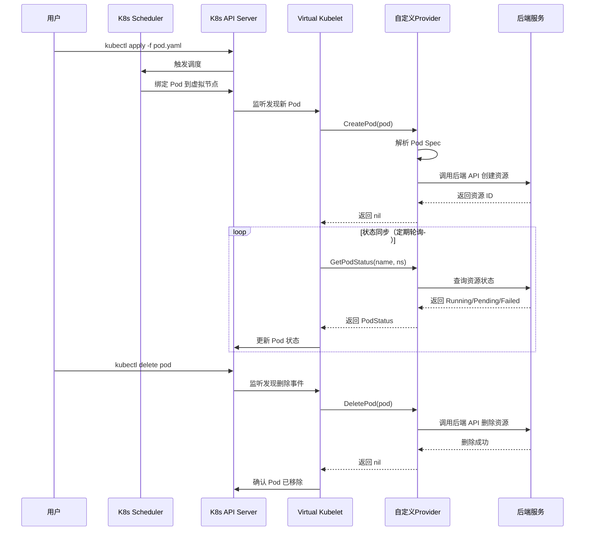
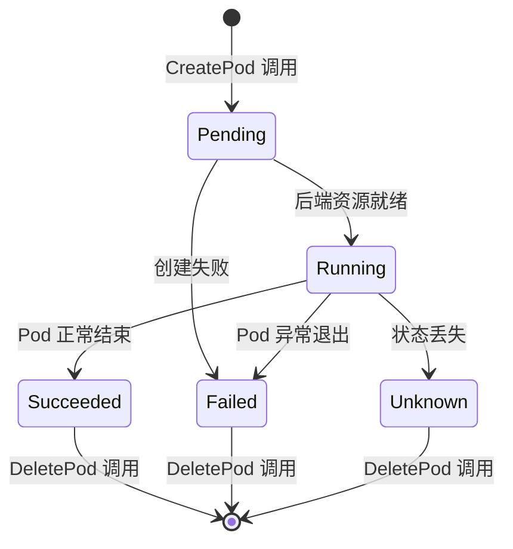
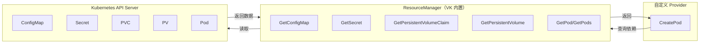
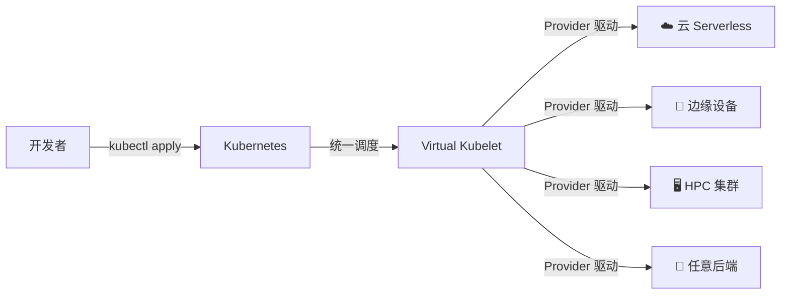

用 2000 字带你彻底搞懂 Virtual Kubelet 的核心机制，手把手实现自定义 Provider。

## 为什么需要 Virtual Kubelet？

Kubernetes 已经成为云原生时代的事实标准，但它的节点管理有一个隐含前提：每个节点都对应一台物理机或虚拟机，节点上运行着 Kubelet、容器运行时等组件。当我们需要将 Pod 调度到云厂商的 Serverless 容器（如 AWS Fargate、阿里云 ECI）或边缘设备、HPC 集群时，这个前提就成了限制。

Virtual Kubelet（VK）正是为了解决这个问题而生。它是一个开源的 Kubelet 替代实现，允许 Kubernetes 集群将 Pod 调度到"虚拟节点"上，从而无缝对接任意后端服务。

本文将深入剖析 VK 的两大核心流程——节点注册与 Pod 生命周期管理，并给出一个自定义 Provider 的实现框架。

---

## 一、Virtual Kubelet 整体架构

VK 的核心设计可以用一句话概括："Kubernetes API on top, programmable backend"。

### 1.1 架构总览图



### 1.2 架构分层说明

| 层级   | 组件                             | 核心职责                                           |
|--------|----------------------------------|---------------------------------------------------|
| 接入层 | Kubernetes API Server + Scheduler | 接收用户请求，执行调度决策，维护集群状态              |
| 核心层 | Virtual Kubelet 进程              | 伪装成 Kubelet 节点，监听 API Server 事件，管理插件   |
| 驱动层 | 自定义 Provider                   | 实现 PodLifecycleHandler 接口，翻译为后端 API 调用   |
| 资源层 | 异构后端                          | 云 Serverless、边缘设备、HPC 集群等实际运行 Pod 的地方 |

### 1.3 数据流走向

```mermaid
flowchart LR
    A["用户提交 Pod YAML"] --> B["API Server 接收并存储"]
    B --> C["Scheduler 调度到虚拟节点"]
    C --> D["VK 监听器捕获事件"]
    D --> E["VK 调用 Provider 方法"]
    E --> F["Provider 调用后端 API"]
    F --> G["后端创建/管理资源"]
    G --> H["Provider 查询状态"]
    H --> I["VK 回写状态到 API Server"]
    I --> J["用户 kubectl get pod 查看"]
```



---

## 二、节点注册：让 Kubernetes "认识"你的虚拟节点

### 2.1 注册流程时序图



### 2.2 核心步骤详解

**第一步：注册 Provider 到 VK**

在代码中通过 `init()` 函数将自定义 Provider 注册到 VK 的全局存储中：

```go
func init() {
    provider.DefaultStore.Register("my-provider", func(cfg provider.InitConfig) (provider.Provider, error) {
        return &MyProvider{config: cfg}, nil
    })
}
```

这是 VK 实现插件化的关键机制——通过 Go 的 `init()` 和全局 Map，将 Provider 的构造函数与名称绑定。启动时只需指定 `--provider=my-provider`，VK 就能找到对应的实现。

**第二步：实现 ConfigureNode 方法**

这个方法决定了虚拟节点的"样貌"，是节点注册的核心：

```go
func (p *MyProvider) ConfigureNode(ctx context.Context, node *v1.Node) {
    // 1. 设置资源容量（调度器决策的关键依据）
    node.Status.Capacity = v1.ResourceList{
        v1.ResourceCPU:    resource.MustParse("100"),
        v1.ResourceMemory: resource.MustParse("100Gi"),
    }
    node.Status.Allocatable = node.Status.Capacity

    // 2. 设置节点网络信息
    node.Status.Addresses = []v1.NodeAddress{
        {Type: v1.NodeInternalIP, Address: "192.168.1.100"},
        {Type: v1.NodeHostName, Address: "my-virtual-node"},
    }

    // 3. 设置操作系统和架构
    node.Status.NodeInfo.OperatingSystem = "linux"
    node.Status.NodeInfo.Architecture = "amd64"

    // 4. 添加标签（用于亲和性调度）
    node.Labels["my-provider/region"] = "us-east-1"
    node.Labels["provider"] = "my-provider"

    // 5. 添加污点（防止普通 Pod 被误调度）
    node.Spec.Taints = []v1.Taint{{
        Key:    "my-provider/virtual-node",
        Effect: v1.TaintEffectNoExecute,
        Value:  "True",
    }}
}
```

> ⚠️ **关键注意事项：**
>
> * **Capacity 必须设置**：这是调度器决定是否将 Pod 分配到该节点的依据，缺失将导致调度失败
> * **建议添加污点**：虚拟节点通常用于特定场景（如 Serverless 或 GPU 任务），污点配合容忍度可以避免普通工作负载被错误调度
> * **Labels 支持精细化调度**：用户可以通过 `nodeSelector` 或 `nodeAffinity` 将 Pod 定向到虚拟节点

完成上述两步后，VK 启动时会自动调用 `ConfigureNode` 构造 Node 对象，并通过 API Server 将节点注册到集群中。

---

## 三、Pod 生命周期：从调度到删除的完整流转

### 3.1 完整时序图



### 3.2 状态流转图



### 3.3 PodLifecycleHandler 接口详解

VK 的核心接口 `PodLifecycleHandler` 定义了 Pod 管理的全部方法：

```go
type PodLifecycleHandler interface {
    CreatePod(ctx context.Context, pod *corev1.Pod) error
    UpdatePod(ctx context.Context, pod *corev1.Pod) error
    DeletePod(ctx context.Context, pod *corev1.Pod) error
    GetPod(ctx context.Context, namespace, name string) (*corev1.Pod, error)
    GetPods(ctx context.Context) ([]*corev1.Pod, error)
    GetPodStatus(ctx context.Context, namespace, name string) (*corev1.PodStatus, error)
}
```

**CreatePod：创建核心逻辑**

这是最复杂的方法，需要将 Pod Spec 转换为后端 API 的请求参数：

```go
func (p *MyProvider) CreatePod(ctx context.Context, pod *corev1.Pod) error {
    // 1. 提取容器配置
    for _, container := range pod.Spec.Containers {
        image := container.Image
        cmd := container.Command
        env := container.Env
        resources := container.Resources
    }

    // 2. 查询依赖资源（ConfigMap / Secret / PVC）
    for _, vol := range pod.Spec.Volumes {
        if vol.PersistentVolumeClaim != nil {
            pvc, err := p.rm.GetPersistentVolumeClaim(
                vol.PersistentVolumeClaim.ClaimName,
                pod.Namespace,
            )
            // 根据 PVC 配置云存储
        }
        if vol.ConfigMap != nil {
            cm, err := p.rm.GetConfigMap(vol.ConfigMap.Name, pod.Namespace)
            // 获取 ConfigMap 数据
        }
    }

    // 3. 调用后端 API 创建资源
    resourceID, err := p.backendAPI.CreateInstance(image, cmd, env, resources)
    if err != nil {
        return err
    }

    // 4. 保存映射关系（Pod UID -> 后端资源 ID）
    p.cache.Set(pod.UID, resourceID)
    return nil
}
```

关键点：

* 使用 `ResourceManager` 而非直接访问 API Server，这是 VK 的设计规范
* 创建成功后必须返回 `nil`，否则 VK 会持续重试
* 建议维护本地缓存，记录 Pod 与后端资源的映射关系

**GetPodStatus：状态同步的关键**

VK 定期轮询此方法获取最新状态，并同步到 API Server：

```go
func (p *MyProvider) GetPodStatus(ctx context.Context, namespace, name string) (*corev1.PodStatus, error) {
    resourceID := p.cache.Get(name, namespace)
    status, err := p.backendAPI.GetStatus(resourceID)
    if err != nil {
        // 后端不存在时返回 nil, nil（而非报错）
        return nil, nil
    }

    // 转换为 Kubernetes PodStatus
    podStatus := &corev1.PodStatus{
        Phase: convertStatus(status.Phase), // Pending/Running/Succeeded/Failed
        Conditions: []corev1.PodCondition{
            {Type: corev1.PodReady, Status: corev1.ConditionTrue},
        },
        ContainerStatuses: []corev1.ContainerStatus{{
            Ready: status.Ready,
            State: corev1.ContainerState{
                Running: &corev1.ContainerStateRunning{
                    StartedAt: metav1.NewTime(status.StartTime),
                },
            },
        }},
    }
    return podStatus, nil
}
```

> ⚠️ **特别提醒：**
>
> * 如果后端资源不存在，必须返回 `nil, nil`，而不是返回错误（VK 会认为是不存在而非异常）
> * 状态映射需要准确（如后端 `Creating` → K8s `Pending`，`Running` → `Running`）

**DeletePod：清理资源**

```go
func (p *MyProvider) DeletePod(ctx context.Context, pod *corev1.Pod) error {
    resourceID := p.cache.Get(pod.UID)
    if resourceID == "" {
        return nil // 资源已不存在
    }

    if err := p.backendAPI.DeleteInstance(resourceID); err != nil {
        return err
    }

    p.cache.Delete(pod.UID)
    return nil
}
```

---

## 四、ResourceManager：查询集群资源的正确方式

VK 提供了一个强大的工具——ResourceManager，它是 Provider 访问集群资源的唯一推荐途径：



| 方法                       | 用途              | 常见场景                    |
|----------------------------|------------------|---------------------------|
| `GetConfigMap(name, ns)`   | 获取 ConfigMap 数据 | 读取应用配置文件             |
| `GetSecret(name, ns)`      | 获取 Secret 数据   | 读取数据库密码、TLS 证书     |
| `GetPersistentVolumeClaim`  | 获取 PVC 配置     | 为 Pod 动态挂载云存储        |
| `GetPersistentVolume`      | 获取 PV 配置      | 获取云盘 ID、NFS 地址等细节 |
| `GetPod(name, ns)` / `GetPods()` | 获取 Pod 信息 | 查询 Pod 最新状态或关联资源 |

```go
// 使用示例：在 CreatePod 中查询 ConfigMap
cm, err := rm.GetConfigMap("app-config", "default")
if err == nil {
    data := cm.Data // 获取配置数据
    dbHost := data["DB_HOST"]
    dbPort := data["DB_PORT"]
}
```

---

## 五、进阶技巧与注意事项

1. **UpdatePod 的处理策略**

   如果后端不支持更新（如 Serverless 容器不支持修改 CPU/内存），直接 `return nil` 即可。但如果涉及镜像或环境变量变更，通常需要先删除再重建。

2. **性能优化：实现 PodNotifier 接口**

   VK 支持主动推送状态变更，避免频繁轮询：

   ```go
   func (p *MyProvider) NotifyPods(ctx context.Context, notifier func(*corev1.Pod)) {
       // 当后端状态变化时，调用 notifier(pod) 推送更新
   }
   ```

3. **并发安全**

   VK 会并发调用 Provider 的方法，如果内部维护了缓存（如 Map），操作时必须加锁。

4. **最终一致性问题**

   `CreatePod` 返回 `nil` 后，VK 立即将该 Pod 标记为调度成功。如果你的后端异步创建资源，建议在确保后端创建成功后再返回，避免状态不一致。

5. **错误处理规范**

   * 后端资源不存在 → 返回 `nil, nil`（而非 error）
   * 网络超时 → 返回 error，触发 VK 重试
   * 权限不足 → 返回 error，记录日志便于排查

---

## 六、总结

Virtual Kubelet 通过节点注册和 Pod 生命周期管理两大核心流程，实现了 Kubernetes 与异构后端的无缝对接：

| 阶段     | 核心方法        | 本质                                  |
|----------|----------------|--------------------------------------|
| 节点注册 | `ConfigureNode` | 构造 Node 对象，向集群"报到"           |
| Pod 创建 | `CreatePod`     | 将 Pod Spec 转换为后端 API 请求        |
| 状态同步 | `GetPodStatus`  | 轮询后端状态，映射为 K8s PodStatus    |
| Pod 删除 | `DeletePod`     | 清理后端资源，移除本地缓存             |

VK 的价值在于：你用标准 Kubernetes YAML 管理 Pod，VK 帮你把它调度到任何地方——云 Serverless、边缘设备、HPC 集群，甚至 IoT 网关。开发者只需关注 Provider 的实现，所有 Kubernetes 侧的交互都由 VK 框架优雅地封装好了。



---

如果你正在开发自己的 Provider，建议先从官方的 Mock Provider 开始实践，逐步替换成你自己的后端逻辑。相信读完本文，你已经有了一个清晰的实现蓝图！

> 本文所有代码示例基于 Virtual Kubelet v1.0+，完整源码可参考 [Virtual Kubelet GitHub](https://github.com/virtual-kubelet/virtual-kubelet)。
