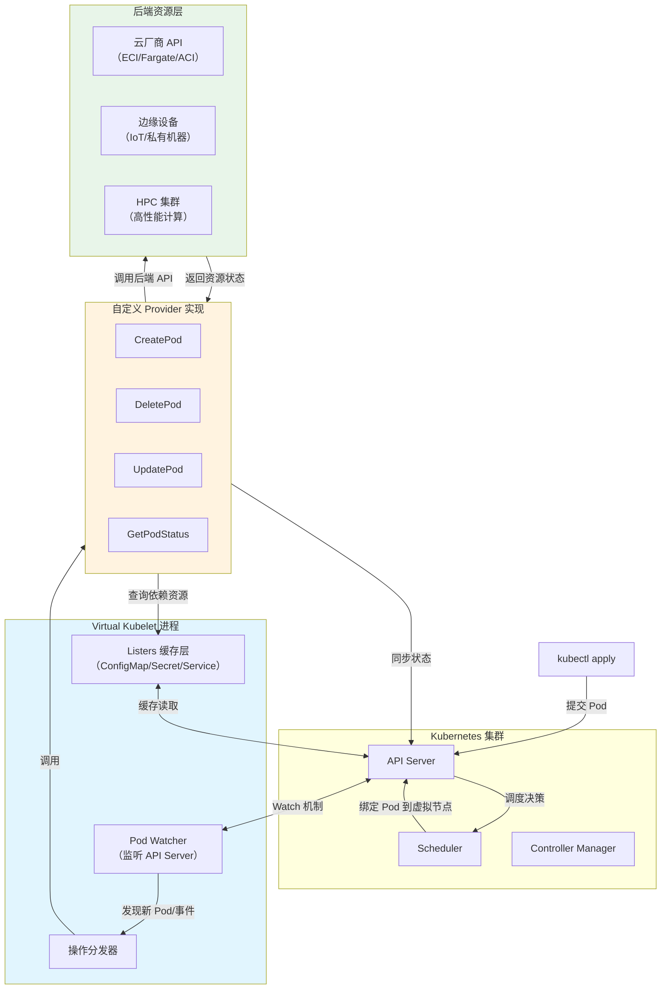
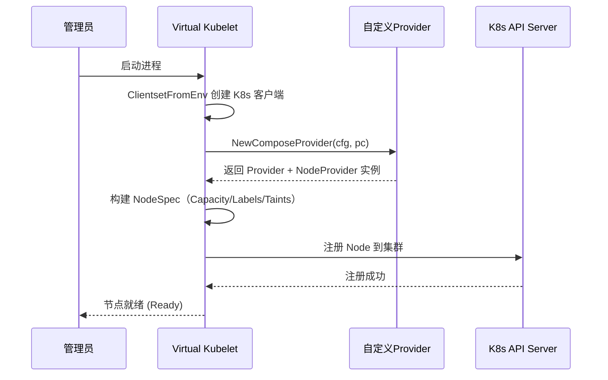
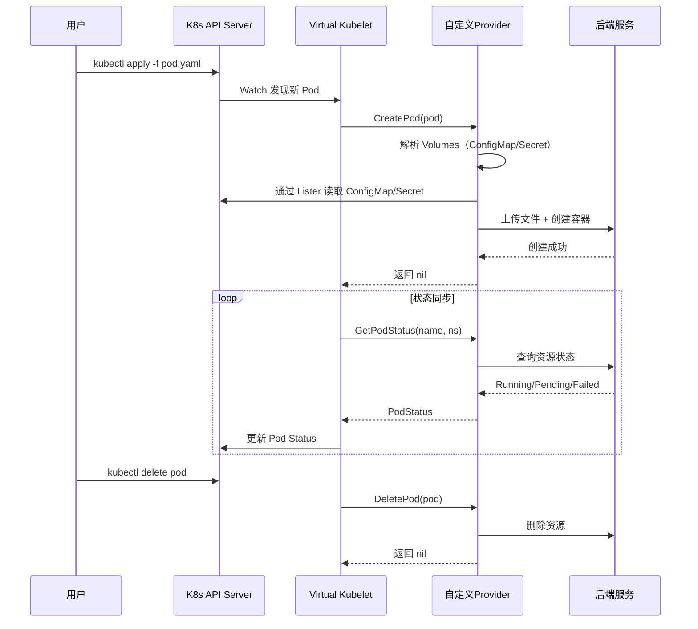
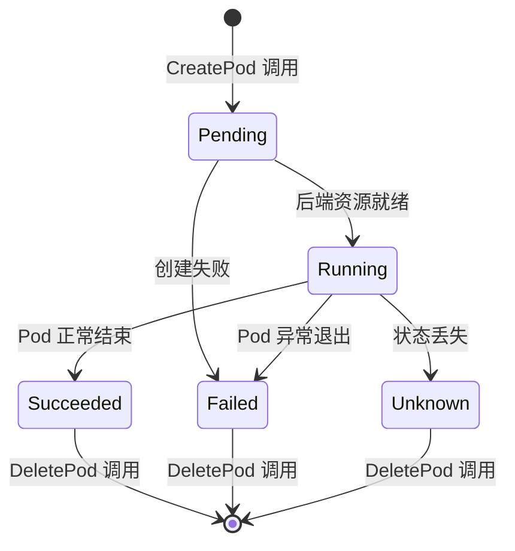
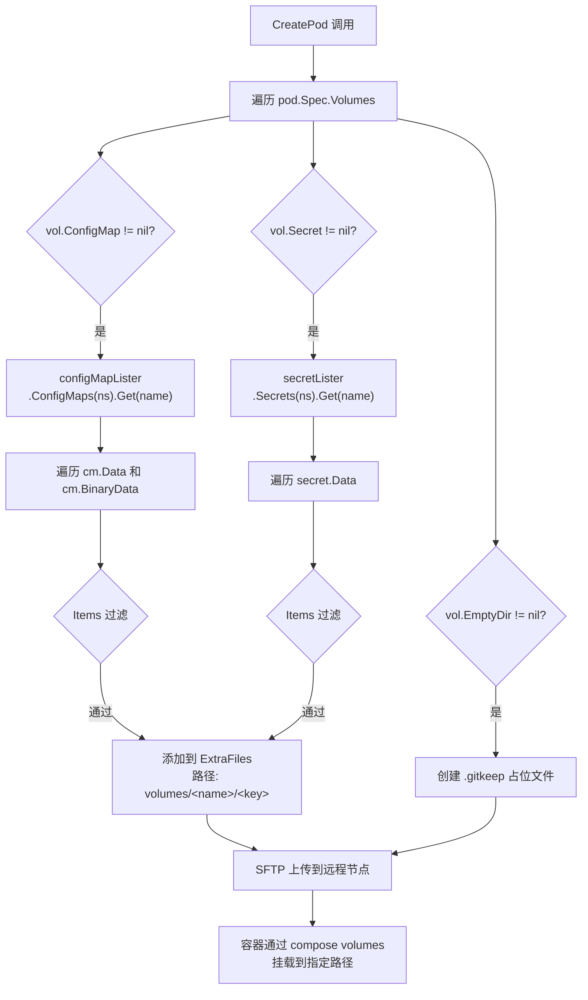
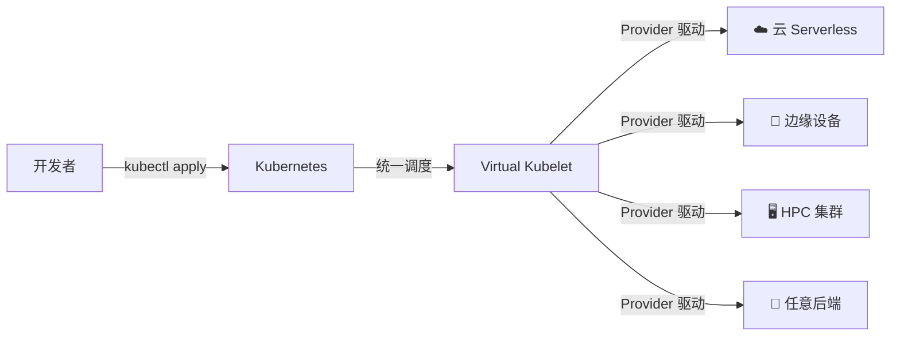

用实战代码带你彻底搞懂 Virtual Kubelet 的核心机制，手把手实现自定义 Provider。

## 为什么需要 Virtual Kubelet？

Kubernetes 成为云原生事实标准，但节点管理有一个隐含前提：每个节点对应一台物理机或虚拟机，运行着 Kubelet、容器运行时。当需要将 Pod 调度到云厂商 Serverless 容器（AWS Fargate、阿里云 ECI）、边缘设备、HPC 集群时，这个前提就成了限制。

Virtual Kubelet（VK）正是解决这个问题的——允许 Kubernetes 将 Pod 调度到"虚拟节点"上，无缝对接任意后端。

---

## 一、Virtual Kubelet 整体架构

VK 的核心设计："Kubernetes API on top, programmable backend"。

### 1.1 架构总览图



### 1.2 架构分层说明

| 层级   | 组件                               | 核心职责                                           |
|--------|-----------------------------------|---------------------------------------------------|
| 接入层 | K8s API Server + Scheduler         | 接收用户请求，执行调度决策，维护集群状态              |
| 核心层 | Virtual Kubelet 进程               | 伪装成 Kubelet 节点，Watch API Server，管理插件       |
| 驱动层 | 自定义 Provider                    | 实现 `nodeutil.Provider` 接口，翻译为后端 API 调用   |
| 资源层 | 异构后端                           | 云 Serverless、边缘设备、HPC 等实际运行 Pod          |

### 1.3 数据流走向


---

## 二、节点注册：让 Kubernetes "认识"你的虚拟节点

VK 提供了两种启动方式：传统的命令行方式（`cmd/virtual-kubelet`）和程序化方式（`nodeutil` 包）。**推荐使用 `nodeutil`**直接在代码中启动，无需依赖 VK 二进制文件。

### 2.1 注册流程时序图



### 2.2 核心代码

**入口 main.go：用 `nodeutil.NewNode` 启动**

```go
func main() {
    ctx, cancel := signal.NotifyContext(context.Background(), syscall.SIGINT, syscall.SIGTERM)
    defer cancel()

    // 1. 创建 K8s 客户端
    kubeClient, err := nodeutil.ClientsetFromEnv(getEnv("KUBECONFIG", ""))
    if err != nil {
        log.Fatal(err)
    }

    // 2. 构建 NodeSpec（决定节点"样貌"）
    nodeSpec := corev1.Node{
        ObjectMeta: metav1.ObjectMeta{
            Name: nodeName,
            Labels: map[string]string{
                "kubernetes.io/role": "agent",
            },
        },
        Spec: corev1.NodeSpec{
            Taints: []corev1.Taint{{
                Key:    "virtual-kubelet.io/provider",
                Value:  "my-provider",
                Effect: corev1.TaintEffectNoSchedule,
            }},
        },
        Status: corev1.NodeStatus{
            Capacity: corev1.ResourceList{
                corev1.ResourceCPU:    resource.MustParse("8"),
                corev1.ResourceMemory: resource.MustParse("16Gi"),
                corev1.ResourcePods:   resource.MustParse("100"),
            },
            NodeInfo: corev1.NodeSystemInfo{
                OperatingSystem: "linux",
                Architecture:    "amd64",
            },
            Conditions: []corev1.NodeCondition{{
                Type:   corev1.NodeReady,
                Status: corev1.ConditionTrue,
            }},
        },
    }

    // 3. 启动虚拟节点
    n, err := nodeutil.NewNode(
        nodeName,
        // 工厂函数：接收 ProviderConfig，返回 Provider
        func(pc nodeutil.ProviderConfig) (nodeutil.Provider, node.NodeProvider, error) {
            return provider.NewMyProvider(cfg, pc)
        },
        nodeutil.WithNodeConfig(nodeutil.NodeConfig{
            NodeSpec:              nodeSpec,
            HTTPListenAddr:        ":10250",
            NumWorkers:            1,
        }),
        nodeutil.WithClient(kubeClient),
    )
    if err != nil {
        log.Fatal(err)
    }

    if err := n.Run(ctx); err != nil {
        log.Fatal(err)
    }
}
```

> **关键点**：
> - `NodeSpec.Status.Capacity` 必须设置——这是调度器分配 Pod 的依据
> - `Taints` + `Tolerations` 避免普通工作负载被误调度到虚拟节点
> - `NodeSpec.Status.Conditions` 中 `NodeReady=True` 否则节点不会被调度器考虑

### 2.3 ProviderConfig：VK 传递给 Provider 的上下文

```go
// nodeutil.ProviderConfig 由 VK 框架构建并传入工厂函数
type ProviderConfig struct {
    Pods       corev1listers.PodLister       // Pod 缓存
    ConfigMaps corev1listers.ConfigMapLister // ConfigMap 缓存（用于解析 volume）
    Secrets    corev1listers.SecretLister    // Secret 缓存（用于解析 volume）
    Services   corev1listers.ServiceLister   // Service 缓存（用于 env vars）
    Node       *v1.Node                      // 节点对象的引用（可修改）
}
```

这组 listers 是 Provider 访问集群资源的唯一途径——**不需要直接调 API Server，也不需要在代码里写 informer**。

---

## 三、Pod 生命周期：从调度到删除的完整流转

### 3.1 完整时序图



### 3.2 状态流转图



### 3.3 Provider 接口

```go
type Provider interface {
    // Pod 生命周期
    CreatePod(ctx context.Context, pod *corev1.Pod) error
    UpdatePod(ctx context.Context, pod *corev1.Pod) error
    DeletePod(ctx context.Context, pod *corev1.Pod) error
    GetPod(ctx context.Context, namespace, name string) (*corev1.Pod, error)
    GetPods(ctx context.Context) ([]*corev1.Pod, error)
    GetPodStatus(ctx context.Context, namespace, name string) (*corev1.PodStatus, error)

    // 容器交互
    GetContainerLogs(ctx context.Context, namespace, podName, containerName string, opts api.ContainerLogOpts) (io.ReadCloser, error)
    RunInContainer(ctx context.Context, namespace, podName, containerName string, cmd []string, attach api.AttachIO) error
    PortForward(ctx context.Context, namespace, pod string, port int32, stream io.ReadWriteCloser) error

    // 监控
    GetStatsSummary(context.Context) (*statsv1alpha1.Summary, error)
    GetMetricsResource(context.Context) ([]*dto.MetricFamily, error)
}
```

### 3.4 CreatePod：创建核心逻辑（含 Volume 解析）

这是最复杂的方法，需要处理两件事：**将 Pod Spec 转换为后端参数**，**解析 Volume（ConfigMap/Secret）**。

```go
type ComposeProvider struct {
    configMapLister corev1listers.ConfigMapLister
    secretLister    corev1listers.SecretLister
    // ...
}

func (p *ComposeProvider) CreatePod(ctx context.Context, pod *corev1.Pod) error {
    podDir := p.podDir(pod)

    // 1. 转换 Pod Spec 为 docker-compose.yml
    composeBytes, err := ConvertToCompose(ctx, pod)

    // 2. 解析 Volume：从 Listers 读取 ConfigMap/Secret 数据
    extraFiles, err := p.resolveVolumes(ctx, pod)
    if err != nil {
        return err
    }

    // 3. 上传文件 + 启动容器
    p.syncClient.Upload(ctx, podDir, composeBytes, extraFiles)
    p.sshClient.Exec(ctx, fmt.Sprintf("cd %s && docker compose up -d", podDir))

    // 4. 缓存 Pod 状态为 Running
    cached := pod.DeepCopy()
    cached.Status = corev1.PodStatus{
        Phase: corev1.PodRunning,
        ContainerStatuses: buildContainerStatuses(pod.Spec.Containers),
    }
    p.pods.Store(key(pod), cached)

    // 5. 推送状态更新
    if p.notifyFunc != nil {
        p.notifyFunc(cached)
    }
    return nil
}
```

**resolveVolumes：ConfigMap/Secret 的正确处理方式**

```go
func (p *ComposeProvider) resolveVolumes(ctx context.Context, pod *corev1.Pod) ([]ExtraFile, error) {
    var files []ExtraFile

    for _, vol := range pod.Spec.Volumes {
        switch {
        case vol.ConfigMap != nil:
            // 通过 Lister 读取（带缓存，不直接调 API）
            cm, err := p.configMapLister.ConfigMaps(pod.Namespace).Get(vol.ConfigMap.Name)
            if err != nil {
                return nil, fmt.Errorf("fetch configmap %s/%s: %w", pod.Namespace, vol.ConfigMap.Name, err)
            }
            for key, data := range cm.Data {
                if !includeVolumeKey(vol.ConfigMap.Items, key) {
                    continue // 尊重 optional items 过滤
                }
                files = append(files, ExtraFile{
                    Path:    filepath.Join("volumes", vol.Name, key),
                    Content: []byte(data),
                })
            }

        case vol.Secret != nil:
            secret, err := p.secretLister.Secrets(pod.Namespace).Get(vol.Secret.SecretName)
            if err != nil {
                return nil, fmt.Errorf("fetch secret %s/%s: %w", pod.Namespace, vol.Secret.SecretName, err)
            }
            for key, data := range secret.Data {
                if !includeVolumeKey(vol.Secret.Items, key) {
                    continue
                }
                files = append(files, ExtraFile{
                    Path:    filepath.Join("volumes", vol.Name, key),
                    Content: data,
                })
            }

        case vol.EmptyDir != nil:
            // EmptyDir 只需要创建一个空目录
            files = append(files, ExtraFile{
                Path:    filepath.Join("volumes", vol.Name, ".gitkeep"),
                Content: []byte{},
            })
        }
    }
    return files, nil
}

// includeVolumeKey 检查 key 是否在 Items 白名单中
func includeVolumeKey(items []corev1.KeyToPath, key string) bool {
    if len(items) == 0 {
        return true // 没有指定 items，所有 key 都包含
    }
    for _, item := range items {
        if item.Key == key {
            return true
        }
    }
    return false
}
```

> **关键点**：
>
> - **使用 Lister 而非直接调 API**：`ProviderConfig` 中的 `ConfigMaps` / `Secrets` listers 由 VK 框架维护，带缓存，性能更好
> - **必须处理 `Items` 过滤**：`vol.ConfigMap.Items` / `vol.Secret.Items` 指定了白名单，未指定的 key 不应包含
> - **ConfigMap 同时有 `Data`（字符串）和 `BinaryData`（[]byte）两种格式**，都要处理
> - **Secret 的 `Data` 是 `map[string][]byte`**，已经 base64 解码过
> - 创建成功必须返回 `nil`，否则 VK 持续重试

### 3.5 GetPodStatus：状态同步

```go
func (p *ComposeProvider) GetPodStatus(ctx context.Context, namespace, name string) (*corev1.PodStatus, error) {
    dir := p.podDir(namespace, name)
    out, err := p.sshClient.Exec(ctx, fmt.Sprintf("cd %s && docker compose ps --format json 2>&1", dir))
    if err != nil {
        // 容器不存在 → 返回 nil, nil
        return &corev1.PodStatus{Phase: corev1.PodFailed}, nil
    }

    // 解析后端状态，映射为 PodStatus
    status := parseContainerStates(out)
    return status, nil
}
```

### 3.6 DeletePod：清理资源

```go
func (p *ComposeProvider) DeletePod(ctx context.Context, pod *corev1.Pod) error {
    dir := p.podDir(pod)
    // docker compose down -v 会清理容器和网络，然后删除整个目录
    p.sshClient.Exec(ctx, fmt.Sprintf("cd %s && docker compose down -v 2>&1; rm -rf %s", dir, dir))

    p.pods.Delete(key(pod))
    return nil
}
```

---

## 四、Volume 处理：ConfigMap / Secret 同步攻略

Volume 处理是 Provider 开发中最容易踩坑的地方。核心流程：



### 远程侧的目录结构

同步完成后，远程节点上的目录结构如下：

```
/opt/vk-pods/default/nginx-demo/
├── docker-compose.yml          # Pod Spec 转换
├── volumes/
│   ├── config/                 # ConfigMap volume
│   │   └── site.conf           # default.conf → site.conf (Items 重命名)
│   ├── secret/                 # Secret volume
│   │   ├── username
│   │   ├── password
│   │   └── token
│   └── cache/                  # EmptyDir volume
│       └── .gitkeep
```

Compose 文件中以 bind mount 方式挂载：

```yaml
services:
  nginx:
    image: nginx:latest
    volumes:
      - "./volumes/config:/etc/nginx/conf.d:ro"
      - "./volumes/secret:/etc/secret:ro"
      - "./volumes/cache:/tmp/cache"
```

### 常见问题

| 问题 | 原因 | 解决 |
|------|------|------|
| Pod 一直在 ContainerCreating | `resolveVolumes` 里只打日志，没实际读取数据 | 实现 Lister 调用逻辑 |
| ConfigMap 更新后 Pod 不生效 | Volume 是一次性同步，后续不会自动更新 | 触发 Pod 重建（kubectl rollout restart） |
| 文件权限问题 | Secret 的 defaultMode 默认 0644 | 需要在 `vol.Secret.DefaultMode` 中设置 |
| Items 指定了 key 还是同步了全部 | 没处理 `vol.ConfigMap.Items` 过滤 | 用 `includeVolumeKey` 做白名单检查 |

---

## 五、进阶技巧与注意事项

1. **UpdatePod 的处理策略**

   如果后端不支持原地更新，最简单可靠的做法是 `DeletePod` + `CreatePod`：

   ```go
   func (p *ComposeProvider) UpdatePod(ctx context.Context, pod *corev1.Pod) error {
       if err := p.DeletePod(ctx, pod); err != nil {
           return err
       }
       return p.CreatePod(ctx, pod)
   }
   ```

2. **性能优化：实现 NotifyPods**

   VK 支持主动推送状态变更（避免频繁轮询）：

   ```go
   func (p *MyProvider) NotifyPods(ctx context.Context, notifier func(*corev1.Pod)) {
       p.notifyFunc = notifier
       go p.statusSyncLoop(ctx, notifier)
   }

   func (p *MyProvider) statusSyncLoop(ctx context.Context, cb func(*corev1.Pod)) {
       ticker := time.NewTicker(30 * time.Second)
       defer ticker.Stop()
       for {
           select {
           case <-ctx.Done():
               return
           case <-ticker.C:
               p.pods.Range(func(_, v interface{}) bool {
                   pod := v.(*corev1.Pod)
                   status, _ := p.GetPodStatus(ctx, pod.Namespace, pod.Name)
                   updated := pod.DeepCopy()
                   updated.Status = *status
                   cb(updated) // 主动推送
                   return true
               })
           }
       }
   }
   ```

3. **并发安全**

   VK 会并发调用 Provider 方法，维护本地缓存必须用 `sync.Map` 或加锁。

4. **错误处理规范**

   | 场景 | 返回 | 含义 |
   |------|------|------|
   | 后端资源不存在 | `nil, nil` | VK 认为 Pod 已删除 |
   | 网络超时 | error | VK 触发重试 |
   | 权限不足 | error | 记录日志，VK 持续重试 |
   | 创建成功 | `nil` | VK 标记为调度成功 |

5. **最终一致性**

   `CreatePod` 返回 `nil` 后 VK 立即标记调度成功。如果后端异步创建资源，确保在资源真正就绪后再返回。

---

## 六、总结

Virtual Kubelet 通过节点注册和 Pod 生命周期管理，实现 Kubernetes 与异构后端的无缝对接：

| 阶段     | 核心方法        | 本质                                      |
|----------|----------------|------------------------------------------|
| 节点注册 | `nodeutil.NewNode` | 构建 NodeSpec，向集群"报到"               |
| Pod 创建 | `CreatePod`     | 解析 Volumes → 转换 Spec → 调用后端 API    |
| 状态同步 | `GetPodStatus`  | 轮询后端状态，映射为 K8s PodStatus        |
| Pod 删除 | `DeletePod`     | 清理后端资源，移除本地缓存                  |



---

如果你正在开发自己的 Provider，建议参考 [k8s-remote-node](https://github.com/zgfh/k8s-remote-node) 的完整实现。相信读完本文，你已经有了一个清晰的实现蓝图。

> 本文代码基于 Virtual Kubelet v1.12，使用 `nodeutil` API（推荐方式）。完整的 Provider 接口文档参见 [Virtual Kubelet GitHub](https://github.com/virtual-kubelet/virtual-kubelet)。
